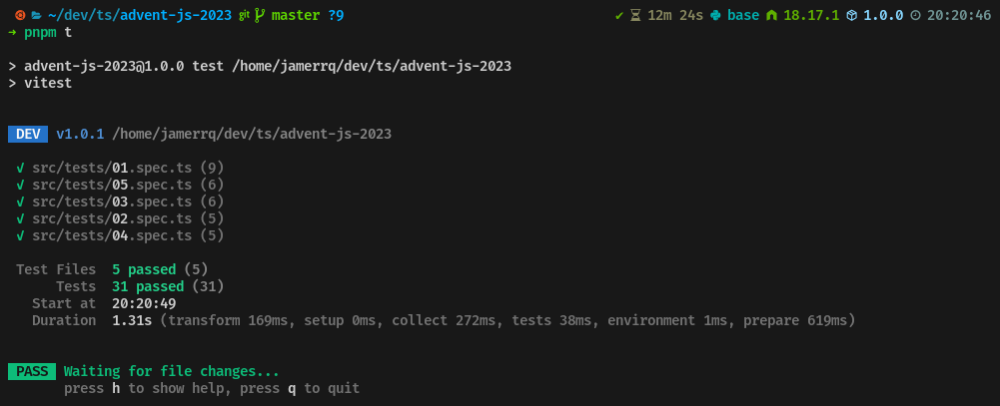
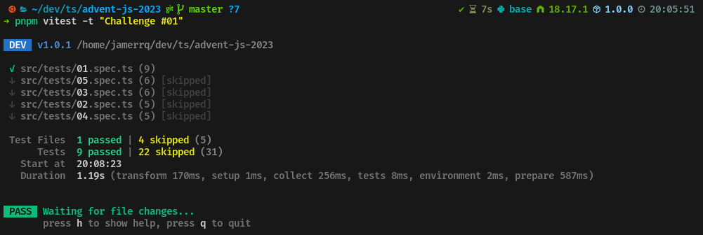

# Advent JS version 2023 🎄

Soluciones bizarras a los retos del [AdventJS](https://adventjs.dev/) 2023.

El [AdventJS](https://adventjs.dev/) es un evento iniciativa de
[@midudev](https://midu.dev/). En él, durante 24 días del mes de diciembre se
estarán publicando retos en la página oficial del evento:

- https://adventjs.dev/

Los retos se pueden resolver tanto en JavaScript como en Typescript.
Para esta versión estaré usando TypeScript, en su versión 5.3.2.

## Retos 🎅

| Día | Reto | Dificultad [^1] | Solución | Tests |
| :-: | :---------------------------------------------------------------------------: | :--------: | :---------------------------------------------------------------------: | :---: |
| 01  | [**¡Primer regalo repetido!**](https://adventjs.dev/es/challenges/2023/1)     |     🟢     | [TS](./src/challenges/01.ts) | [SPEC](./src/tests/01.spec.ts) |
| 02  | [**Ponemos en Marcha la fabrica**](https://adventjs.dev/es/challenges/2023/2) |     🟢     | [TS](./src/challenges/02.ts) | [SPEC](./src/tests/02.spec.ts) |
| 03  | [**El elfo travieso**](https://adventjs.dev/es/challenges/2023/3)             |     🟢     | [TS](./src/challenges/03.ts) | [SPEC](./src/tests/03.spec.ts) |
| 04  | [**Dale vuelta a los parentesis**](https://adventjs.dev/es/challenges/2023/4) |     🟠     | [TS](./src/challenges/04.ts) | [SPEC](./src/tests/04.spec.ts) |
| 05  | [**El CyberTruck de Santa**](https://adventjs.dev/es/challenges/2023/5)       |     🟠     | [TS](./src/challenges/05.ts) | [SPEC](./src/tests/05.spec.ts) |
| 06  | [**Los renos a prueba**](https://adventjs.dev/es/challenges/2023/6)           |     🟢     | [TS](./src/challenges/06.ts) | [SPEC](./src/tests/06.spec.ts) |
| 07  | [**Las cajas en 3d**](https://adventjs.dev/es/challenges/2023/7)              |     🟢     | [TS](./src/challenges/07.ts) | [SPEC](./src/tests/07.spec.ts) |
| 08  | [**Ordenando el almacen**](https://adventjs.dev/es/challenges/2023/8)         |     🟠     | [TS](./src/challenges/08.ts) | [SPEC](./src/tests/08.spec.ts) |
| 09  | [**Alterna las luces**](https://adventjs.dev/es/challenges/2023/9)            |     🟢     | [TS](./src/challenges/09.ts) | [SPEC](./src/tests/09.spec.ts) |

## Herramientas utilizadas 🛠️


## Tests 🧪

Para ejecutar los tests de los retos, se debe ejecutar el siguiente comando:

```bash
pnpm t
```


## Test individuales 🔬

Para ejecutar un reto en particular, se debe ejecutar el siguiente comando:

```bash
pnpm vitest src/tests/{day}.spec.ts
```


O también se puede ejecutar el siguiente comando:

```bash
pnpm vitest -t "Challenge #{day}"
```
Este comando los listará todos pero solo ejecutará el que se le indique.



## Github Actions (instalación de dependencias, lint, tests) 🚀

[](https://github.com/jamerrq/advent-js-2023/actions/workflows/ci-eslint-tests.yml)

## Copyrigth

© 2023 [jamerrq](https://github.com/jamerrq)

[^1]: **Dificultad**: 🟢 Facil 🟠 Media 🔴 Dificil
